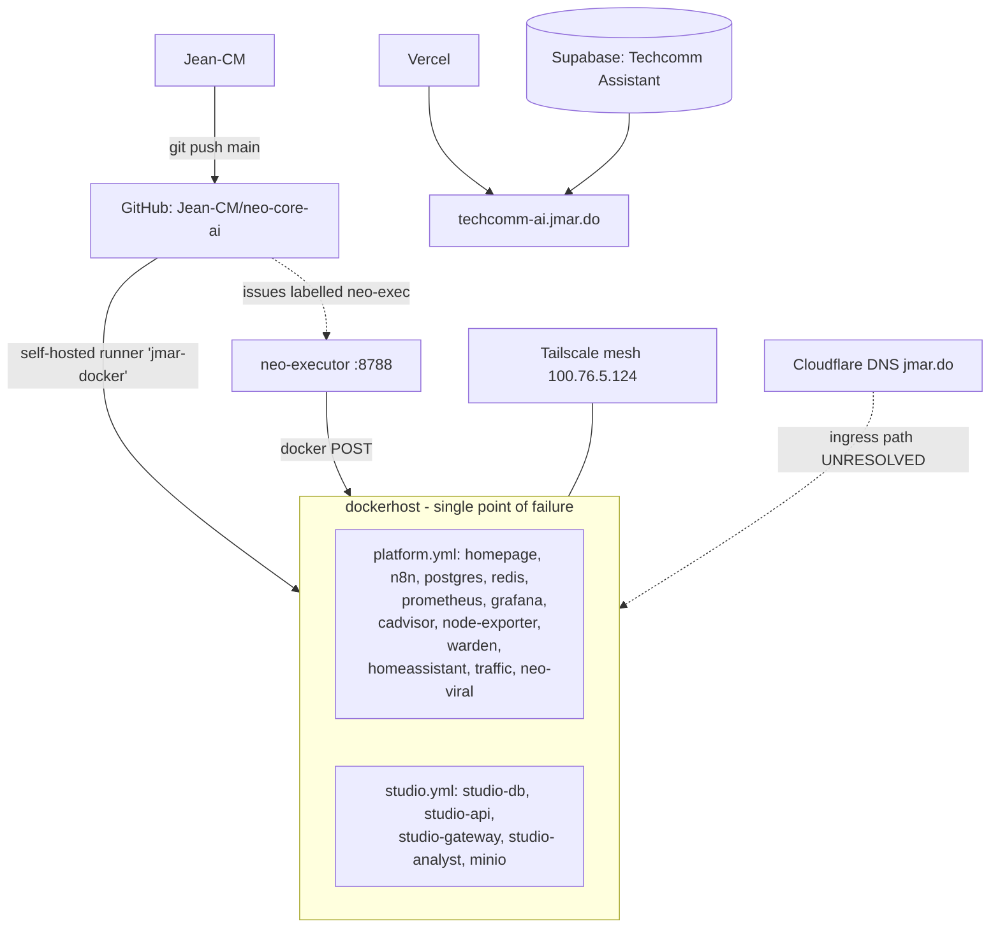

# NEO-INFRA-CONTEXT

**Purpose:** portable technical memory of the JMAR / NEO ecosystem. Written so any AI agent
(Claude Code, ChatGPT, Codex, Gemini) can resume work with **no prior conversation history**.

**Last updated:** 2026-08-22 · **Audit mode:** read-only · **Nothing was modified.**

---

## 1. READ THIS FIRST — corrections to the legacy project narrative

Prior project documentation describes an ecosystem that discovery **could not confirm**.
Do not repeat these assumptions. Each was tested:

| Legacy claim | Reality (2026-08-22) |
|---|---|
| Proxmox node `jmarlab` runs the homelab | **Not found.** Probe ran on `dockerhost`; `192.168.1.10` closed; LAN is `10.0.0.0/24` |
| Cloudflare Tunnel exposes services | **No evidence.** No cloudflared anywhere. Tailscale is the working path |
| `Hermes` is an ecosystem component | **Does not exist.** Only npm `hermes-parser`/`hermes-estree` |
| Supabase `neo-core-prod` is production | **Does not exist.** Only `Techcomm Assistant` + `CasaGO` |
| Supabase org `JMAR NEO RECOVERY` | **Does not exist.** Only `JMAR NEO` |

**Rule for any agent: verify before acting. The docs describe intent; the probes describe reality.**

---

## 2. What the ecosystem actually is

One Docker host, reached over Tailscale, deployed from one GitHub monorepo via a self-hosted runner.

**Key facts**
- Host: `dockerhost`, `10.0.0.59` (LAN `10.0.0.0/24`, gw `10.0.0.1`, iface `enp6s18`, DHCP)
- Tailscale: `100.76.5.124`, `dockerhost.tailda8389.ts.net`, **Funnel DISABLED**
- 21 containers declared across 3 compose projects
- CI/CD: 9 GitHub Actions workflows; runner label `jmar-docker`, user `jmaradmin`
- Last verified heartbeat: **2026-08-19T18:21:13Z** (`studio_api_ok: true`, `analyst_ok: true`)

---

## 3. Repository map

| Repo | Role | Access notes |
|---|---|---|
| `Jean-CM/neo-core-ai` (private) | **NEO monorepo + all HomeLab IaC.** `apps/`, `infra/compose/`, `database/`, `ops/`, workflows | The real control plane |
| `Jean-CM/techcomm-ai` (public) | Techcomm Operations, Next.js → Vercel | **OUT_OF_SCOPE for changes** (operator rule 41) |

14 other repos exist (WatchEagle ×2, payflow-control, renta-mapa-rd, …) — see `inventory/repositories.yaml`.
**No `jmar-infrastructure` repo exists**; IaC lives in `neo-core-ai/infra/`.

---

## 4. Open risks (full detail in DISCOVERY-REPORT.md)

| Sev | Issue |
|---|---|
| 🔴 | **Grafana admin password never set** → default `admin` for `jmaradmin`, LAN-reachable on :3000 |
| 🔴 | **No backups exist for anything** — 3 Postgres DBs, MinIO, n8n, Grafana, Home Assistant |
| 🔴 | **`N8N_ENCRYPTION_KEY` has no durable copy** — losing it permanently destroys all n8n credentials |
| 🟠 | **neo-executor** runs container actions from GitHub issues with **no author check** |
| 🟠 | **NEO-Core's Supabase schema is deployed nowhere** — the app has no verified database |
| 🟠 | Ingress path from `jmar.do` to `10.0.0.59` is **unexplained** |
| 🟡 | 11 of 15 images use floating tags; 18 of 21 containers lack healthchecks |
| 🟡 | `homepage` mounts the raw Docker socket while a hardened proxy already exists |
| 🟡 | 5 services advertised on the dashboard exist in no compose file |

**Good practices already in place — preserve these:**
NEO-WARDEN's `observe-first` policy · socket-proxy with `POST:0` for Warden ·
Studio/MinIO bound to `127.0.0.1` · MinIO anonymous access explicitly `none` ·
clean secret hygiene (57 commits scanned, no secrets; no tracked `.env`) · idempotent SQL migrations.

---

## 5. Working rules for agents on this ecosystem

1. **Read-only first.** Probe before you change. The documentation is aspirational in places.
2. **`techcomm-ai` and `CasaGO` are OUT_OF_SCOPE** for modification — audit only.
3. **Never** run `docker system prune`, `volume prune`, `rm -rf`, `DROP`, `TRUNCATE`, force-push,
   or delete DNS records / tunnels without explicit authorization.
4. **There are no backups.** Until Phase 1 lands, treat every stateful change as irreversible.
5. **Do not delete `UNKNOWN_COMPONENT` items** (e.g. the unconfirmed Proxmox entry). Investigate.
6. **Never commit secrets.** Use GitHub Actions secrets. Report findings redacted (`sk-****abcd`).
7. **Distinguish "blocked" from "down".** In sandboxed sessions the egress proxy returns 403 to
   CONNECT, which surfaces as HTTP `000`. That is **not** an outage. Always run a control test.
8. State confidence (`HIGH`/`MEDIUM`/`LOW`) and status (`VERIFIED`/`PARTIALLY VERIFIED`/
   `UNVERIFIED`/`BLOCKED`) on every claim.

---

## 6. Access matrix for a fresh session

| Plane | How to get it | Status in the 2026-08-22 session |
|---|---|---|
| GitHub | MCP / token | 🟢 authenticated as `Jean-CM` |
| Supabase | MCP | 🟢 org `JMAR NEO` |
| Vercel | MCP | 🟡 `get_project` by slug only; `list_projects` broken |
| Homelab | Tailscale + SSH to `jmaradmin@10.0.0.59` | 🔴 unavailable |
| Docker | on `dockerhost` | 🔴 unavailable |
| Cloudflare | API token | 🔴 not provisioned — **blocks the DNS→origin map** |
| Proxmox | unknown | 🔴 unconfirmed to exist |

**The single highest-value access to add next is a Cloudflare API read token** — it resolves the
ingress question that currently blocks safe network changes.

---

## 7. Where to pick up

`REMEDIATION-PLAN.md` is ordered and ready. Start at **Phase 1** (Grafana credential → backups →
n8n key), then **Phase 3** investigations, which gate the network changes in Phase 2.

Inventory source-of-truth files (machine-readable, valid YAML):
`inventory/hosts.yaml` · `services.yaml` · `domains.yaml` · `databases.yaml` · `repositories.yaml`
